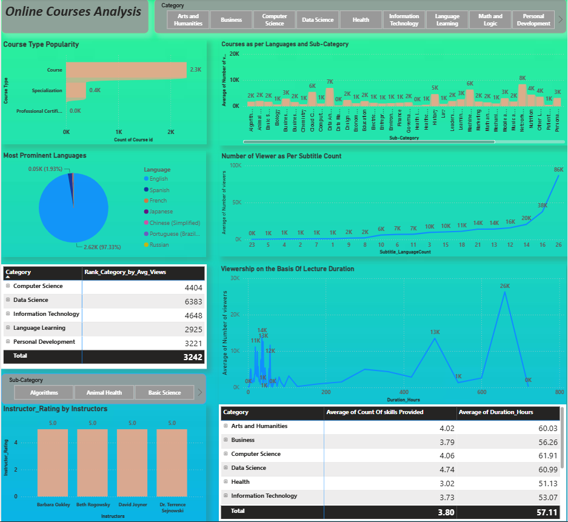

# 🎓 EdTeach Online Courses Analysis Dashboard

## 📌 Project Overview

The **EdTeach Online Courses Analysis Dashboard** is a Business Intelligence project developed using **Power BI** to analyze online learning platform performance. The dashboard transforms raw course data into meaningful insights, helping stakeholders understand learner behavior, course popularity, instructor performance, pricing trends, and revenue generation.

This project demonstrates end-to-end data analytics skills, including data cleaning, transformation, modeling, DAX calculations, and interactive dashboard development.

---

## 🎯 Business Objective

Online learning platforms generate large volumes of data from courses, instructors, enrollments, and ratings. Without proper analysis, it becomes difficult to identify:

* Top-performing courses
* Popular learning categories
* Revenue-driving courses
* Instructor effectiveness
* Student engagement patterns
* Pricing strategy effectiveness

This dashboard helps decision-makers make data-driven business decisions through visual analytics.

---

## 📊 Dashboard Highlights

### Executive KPIs

* Total Courses
* Total Enrollments
* Total Revenue
* Average Course Rating
* Average Course Price

### Course Performance Analysis

* Top Revenue-Generating Courses
* Most Enrolled Courses
* Highest Rated Courses
* Course Popularity Analysis

### Category Analysis

* Revenue by Category
* Enrollment by Category
* Course Distribution Across Categories

### Instructor Analysis

* Instructor-wise Revenue
* Instructor Ratings Comparison
* Instructor Performance Ranking

### Pricing Analysis

* Free vs Paid Courses
* Price Distribution
* Pricing Impact on Enrollments

### Learner Engagement Analysis

* Rating Distribution
* Enrollment Trends
* Course Popularity Metrics

---

## 🛠️ Tools & Technologies Used

* Power BI Desktop
* Power Query
* DAX (Data Analysis Expressions)
* Data Modeling
* Data Visualization
* Business Intelligence

---

## 📂 Dataset Information

**Dataset Source:** Kaggle

The dataset contains information related to online courses, including:

* Course Title
* Subject Category
* Instructor Details
* Course Price
* Number of Subscribers
* Number of Reviews
* Course Ratings
* Revenue-related Metrics

The dataset was cleaned and transformed using Power Query before building the dashboard.

---

## 🔄 Data Preparation Process

### Data Cleaning

* Removed duplicate records
* Handled missing values
* Corrected data types
* Standardized column formats

### Data Transformation

* Created calculated columns
* Applied business rules
* Performed data validation

### Data Modeling

* Built relationships between tables
* Created DAX measures
* Optimized model performance

---

## 📈 Key Business Insights

* Identified the highest revenue-generating courses.
* Discovered the most popular course categories.
* Analyzed the relationship between ratings and enrollments.
* Evaluated instructor contribution to platform growth.
* Compared free and paid course performance.
* Identified trends affecting learner engagement and revenue.

---

## 📸 Dashboard Preview

---

## 📋 KPIs Tracked

| KPI               | Description                       |
| ----------------- | --------------------------------- |
| Total Courses     | Total number of available courses |
| Total Enrollments | Total learners enrolled           |
| Total Revenue     | Revenue generated from courses    |
| Average Rating    | Average learner rating            |
| Top Category      | Best-performing course category   |
| Top Instructor    | Highest-performing instructor     |

---

## 💼 Business Value

The dashboard enables educational organizations to:

* Improve course offerings
* Optimize pricing strategies
* Increase learner engagement
* Track business performance
* Identify growth opportunities
* Make data-driven decisions

---
